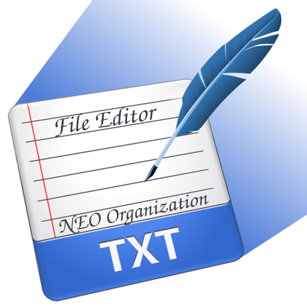

# Редактор Файлов - NEO Organization

***Редактор Файлов*** - Это **простой** и **лёгкий** блокнот на **Python**.

> [!Note]
> Хотите помочь с переводом программы или документации? PullRequest и почта neo.organization.official@gmail.com открыты!

### Функционал Редактора Файлов:
- Редактирование текстовый файлов *(удивительно)*
- Изменение шрифта и его размера
- Поиск с подсветкой совпадений
- Работой по верх остальных окон
- Система тем *(не работает, подробней позже)*
- Возможность шифрования содержимого файлы через AES шифрование
- Система локализации на разные языки

### Поиск
В верхней части окна есть панель для поиска, скрыть её можно на крестик справа или сочетанием Ctrl+F, чтобы вернуть её снова нажмите Ctrl+F. Поиск поддерживает:
- Учитывание регистра
- Поиск слов целиком
- Навигация по совпадениям

### Работа поверх остальных окон
В верхней панели есть пункт "Поверх остальных окон", он позволяет управлять системой работы поверх всех окон, когда данный параметр активен у вас не выйдет перекрыть окно редактора файлов другим окном.

### Система тем (Интерфейс)
Интерфейс сделан на tkinter, из-за чего он крайне лёгкий но так как стандартный tkinter не слишком красочный, была добавлена система тем. Однако по неизвестной (пока, что) мне причине именно в этом компоненте она не работает. Если вы знаете в чём дело, напишите на почту neo.organization.official@gmail.com.

### Шифрование
При сохранении или открытии файла программа также спросит зашифровать или расшифровать файл, в случае положительного ответа программа запросит от вас ключ для шифрования. Используется AES шифрование.

### Перевод программы
В config.py можно изменить язык программы, доступные языки: Русский, Английский, Украинский.

> [!Note]
> Изменение языка будет не только в интерфейсе программы, но и в логах!

### Прочие уточнения
- Используется библиотека loguru для логирования.
- Вы можете отредактировать цвета стандартных тем в config.py
- Данный репозиторий является ответвлением проекта ***Антивируса Монтировка*** - [Github](https://github.com/AnonimNEO/Crowbar-Antivirus) и [Codeberg](https://codeberg.org/AnonimNEO/Crowbar-Antivirus)

### Хотите помочь проекту?
Хотите помочь проекту? Ниже список задач с которыми вы бы могли бы помочь:
- [ ] Починить переключение тем

Написать о своей идее или предложению можете на почту neo.organization.official@gmail.com.
